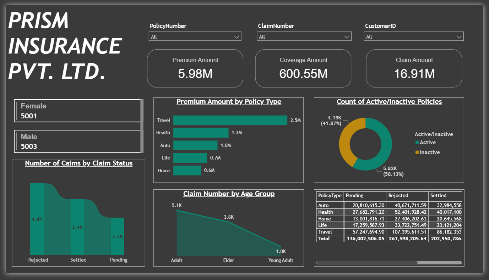
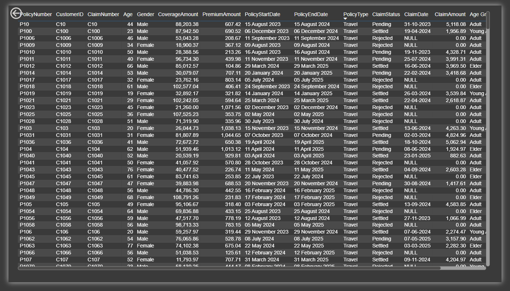
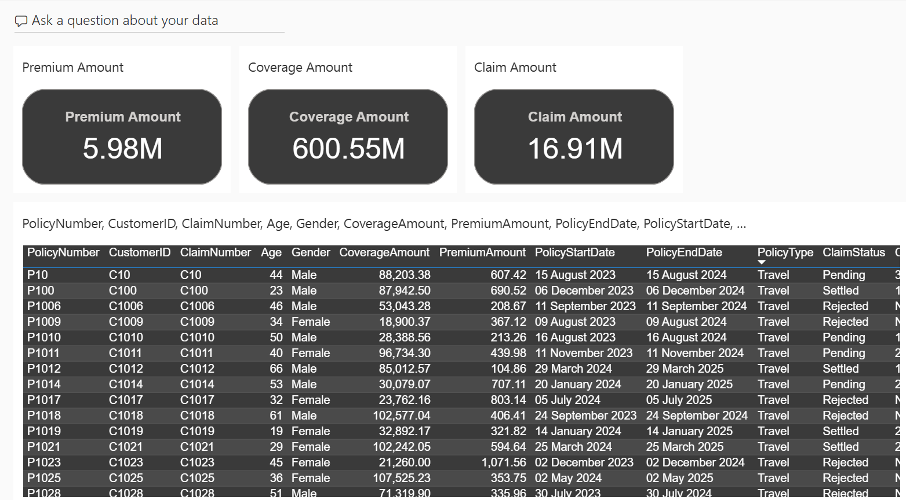

#  PRISM Insurance Dashboard

This project presents an **Insurance Analytics Dashboard** built with **Power BI** to explore customer demographics, policy distribution, and claims analysis for **Prism Insurance Pvt. Ltd.**

It enables decision-makers to monitor premiums, claims, policy types, and customer segmentation interactively through slicers, visualizations, and drill-through filters.

---

##  Problem Statement

Insurance companies handle large volumes of policies, claims, and customer information across diverse demographics. Without a centralized analytics view, it becomes difficult to:

* Track active vs inactive policies.
* Understand claim distribution by type, status, and customer demographics.
* Identify financial exposure in pending and rejected claims.
* Improve retention rates by analyzing inactive policy trends.
* Optimize premium collection and claim settlement efficiency.

This dashboard solves these challenges by providing **real-time, interactive insights** into policy, claim, and customer behavior.

---

##  Live Links

* **Dataset**: [Download Dataset](https://drive.google.com/file/d/1vsgrDkg8fsrkxM19X6ko6oGFzejNYRSo/view?usp=sharing)
* **Report Link**: [View Report on Power BI](https://app.powerbi.com/groups/83d165f6-7d34-4d6e-92ea-90e317a862f0/reports/26bc50a9-df62-46a2-8bc4-7761c9ec5508/021b1937cd250390995d?experience=power-bi)
* **Dashboard Link**: [Insurance Dashboard](https://app.powerbi.com/groups/83d165f6-7d34-4d6e-92ea-90e317a862f0/dashboards/b1366158-b4d0-4fb2-8cb5-1ea484f2b756?experience=power-bi)

---

##  KPI Summary

| Metric              | Value              | Key Insight                                                               |
| ------------------- | ------------------ | ------------------------------------------------------------------------- |
| **Premium Amount**  | **5.98M**          | Strong premium collection, led by **Travel Insurance** (2.5M).            |
| **Coverage Amount** | **600.55M**        | Large financial exposure, majority in **Travel & Health** policies.       |
| **Claim Amount**    | **16.91M**         | Indicates active claim engagement across customers.                       |
| **Active Policies** | **5.82K (58.13%)** | Majority active, but **41.87% inactive** signals retention opportunities. |
| **Rejected Claims** | **4.4K**           | Higher than settled (3.4K), improvement needed in approvals.              |
| **Claims by Age**   | **Adults (5.1K)**  | Adults dominate claim volume; Elders also significant (3.8K).             |

---

##  Dashboard Analysis

1. **Customer Demographics**

   * Male and female customers are nearly balanced (5003 vs 5001).
   * Majority of claims originate from **Adults (5.1K)**, followed by **Elders (3.8K)**, and **Young Adults (1K)**.

2. **Claims Insights**

   * Total **Claim Amount**: **16.91M**.
   * Most claims are **Rejected (4.4K)**, followed by **Settled (3.4K)**, and **Pending (2.3K)**.
   * Claim settlement efficiency can be further improved since rejection rates are high.

3. **Policy Performance**

   * Total **Premium Collected**: **5.98M**.
   * Total **Coverage Amount**: **600.55M**.
   * **Travel Insurance** dominates premium collection (**2.5M**), followed by **Health (1.2M)**, and **Auto (1M)**.

4. **Policy Status**

   * **Active Policies**: 58.13% (5.82K).
   * **Inactive Policies**: 41.87% (4.19K).
   * Monitoring upcoming expirations is critical to improving retention rates.

5. **Financial Breakdown by Policy Type**

   * Pending claims: **136M**.
   * Rejected claims: **261M**.
   * Settled claims: **202M**.
   * Travel policies have the highest financial exposure (**107M pending, 86M settled**).

---

##  Steps Followed in Power BI

1. Uploaded dataset into **Power BI**.
2. Added **slicers** for: `PolicyNumber`, `ClaimNumber`, `CustomerID`.
3. Created **Card Visuals** for:

   * Total Premium Amount
   * Total Coverage Amount
   * Total Claim Amount
4. Added **Multi Row Card** for gender-wise count.
5. Built **Ribbon Chart** for `ClaimStatus` & number of claims.
6. Created **Bar Chart** showing Premium Amount by Policy Type.
7. Added a **Conditional Column – Age Group**:

   * `<= 24`: Young Adult
   * `<= 60`: Adult
   * `> 60`: Elder
8. Built **Line Chart** for Claim Numbers by Age Group.
9. Added **Conditional Column – Active/Inactive**:

   * If `PolicyEndDate <= 10-12-2024 → Inactive`
   * Else → Active
10. Designed **Donut Chart** for Active/Inactive policies.
11. Built **Matrix Visual** with:

* Rows: PolicyType
* Columns: ClaimStatus
* Values: Sum of Coverage Amount

12. Scheduled **daily refresh at 1:00 AM**.
13. Implemented **Drill-through filters** on Table Visual with:
    `PolicyNumber, CustomerID, ClaimNumber, Age, Gender, CoverageAmount, PremiumAmount, PolicyStartDate, PolicyEndDate, PolicyType, ClaimStatus, ClaimDate, ClaimAmount, Age Group, Active/Inactive`.
14. Added **PolicyType** in drill-through fields.
15. Created **Row-level Security Roles**:

* `Travel Role`: filter PolicyType = Travel
* `Health Role`: filter PolicyType = Health

16. Built **Dashboard: Insurance** and pinned:

* Premium Amount Card
* Coverage Amount Card
* Claim Amount Card
* Table visual (Page 2).

---

##  Dashboard Preview

### Overview Page

### Detailed Claims Table

### Dashboard: Insurance

---

##  Key Takeaways

* **Travel Insurance** contributes the highest premiums and claim volumes.
* **Rejected claims (4.4K)** exceed settled ones (3.4K), highlighting potential process inefficiencies.
* **Adults** represent the majority of claimants, while **Elders** show rising claim frequency.
* Around **42% of policies are inactive**, indicating an opportunity for retention campaigns.

